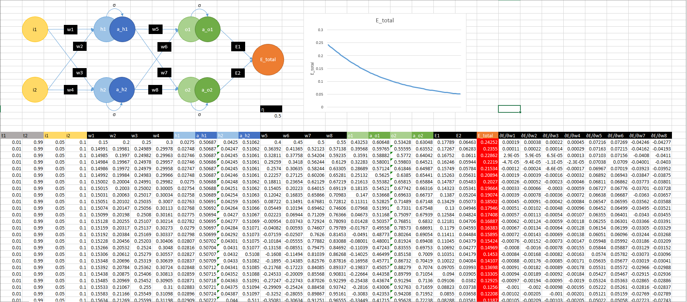
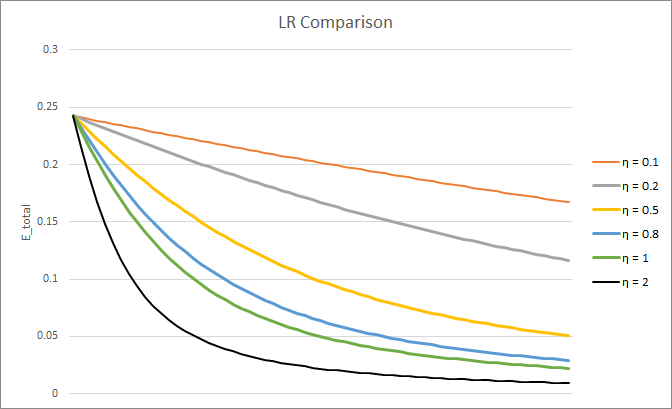

# Back Propagation
We are using ``Gradient Descent`` algorithm to update our weights.

You can download or view the excel in Google Sheets using the below links:

[Download](https://github.com/hassiahk/EVA6-Phase1-Assignments/raw/main/Session4-BackProp_Model_w_lt_20k/Part1-Back_Propagation/Back_Propagation.xlsx) | [Google Sheet](https://drive.google.com/file/d/11sM8N3gR3W5K56zKxsVBbVCXDeJaqRhl/view?usp=sharing)



## Model Architecture
Below is the neural network architecture which has one input layer, one hidden layer and one output layer. Every layer is a fully connected layer.


## Gradient Descent
We will be using ``Gradient Descent`` algorithm to update our weights. Below is the equation used to update each weight.

<div align="center"><a href="https://www.codecogs.com/eqnedit.php?latex=\dpi{120}&space;W_{i}&space;=&space;W_{i}-\eta&space;*&space;\frac{\partial&space;E_{total}}{\partial&space;W_{i}}" target="_blank"></a></div>

## Forward Propagation
At hidden layer, we have ``h1`` and ``h2`` neurons whose values can be calculated using below equations:

<div align="center"><a href="https://www.codecogs.com/eqnedit.php?latex=\dpi{120}&space;\begin{multline}&space;{\color{Black}&space;h_1=w_1*i_i&plus;w_2*i_2}&space;\\&space;\\&space;h_2=w_3*i_1&plus;w_4*i_2&space;\end{multline}" target="_blank"></a></div><br>

Activation of hidden layer neurons ``h1`` and ``h2`` are ``a_h1`` and ``a_h2`` respectively whose values can be calculated using below equations:

<div align="center"><a href="https://www.codecogs.com/eqnedit.php?latex=\dpi{120}&space;\begin{multline}&space;{\color{Black}&space;a\_h_1&space;=&space;\sigma(h_1)&space;=&space;\frac{1}{1&space;&plus;&space;e^{-h_1}}}&space;\\&space;\\&space;a\_h_2&space;=&space;\sigma(h_2)&space;=&space;\frac{1}{1&space;&plus;&space;e^{-h_2}}&space;\end{multline}" target="_blank"></a></div><br>

At output layer, we have ``o1`` and ``o2`` neurons whose values can be calculated using below equations:

<div align="center"><a href="https://www.codecogs.com/eqnedit.php?latex=\dpi{120}&space;\begin{multline}&space;{\color{Black}&space;o_1=w_5*a\_h_1&plus;w_6*a\_h_2}&space;\\&space;\\&space;o_2=w_7*a\_h_1&plus;w_8*a\_h_2&space;\end{multline}" target="_blank"></a></div><br>

Activation of output layer neurons ``o1`` and ``o2`` are ``a_o1`` and ``a_o2`` respectively whose values can be calculated using below equations:

<div align="center"><a href="https://www.codecogs.com/eqnedit.php?latex=\dpi{120}&space;\begin{multline}&space;{\color{Black}&space;a\_o_1&space;=&space;\sigma(o_1)&space;=&space;\frac{1}{1&space;&plus;&space;e^{-o_1}}}&space;\\&space;\\&space;a\_o_2&space;=&space;\sigma(o_2)&space;=&space;\frac{1}{1&space;&plus;&space;e^{-o_2}}&space;\end{multline}" target="_blank"></a></div><br>

And if we look at the architecture, we can see that our total loss (``E_total``) is

<div align="center"><a href="https://www.codecogs.com/eqnedit.php?latex=\dpi{120}&space;E_{total}&space;=&space;E_1&space;&plus;&space;E_2" target="_blank"></a></div>

where,

<div align="center"><a href="https://www.codecogs.com/eqnedit.php?latex=\dpi{120}&space;\begin{multline}&space;{\color{Black}&space;E_1&space;=&space;\frac&space;{1}{2}&space;*&space;(t_1&space;-&space;a\_o_1)^2&space;\&space;,&space;\&space;where&space;\&space;\&space;t_1&space;\&space;\&space;is&space;\&space;\&space;target_1}&space;\\&space;\\&space;E_2&space;=&space;\frac&space;{1}{2}&space;*&space;(t_2&space;-&space;a\_o_2)^2&space;\&space;,&space;\&space;where&space;\&space;\&space;t_2&space;\&space;\&space;is&space;\&space;\&space;target_2&space;\end{multline}" target="_blank"></a></div>

### Initial Weights
```
w1 = 0.15, w2 = 0.2, w3 = 0.25, w4 = 0.3, w5 = 0.4, w6 = 0.45, w7 = 0.5, w8 = 0.55
```

## Back Propagation using Gradient Descent
We need to find the gradient of ``E_total`` w.r.t ``w1``, ``w2``, ``w3``, ``w4``, ``w5``, ``w6``, ``w7``, ``w8``

<div align="center"><a href="https://www.codecogs.com/eqnedit.php?latex=\dpi{120}&space;\frac{\partial&space;E_{total}}{\partial&space;W_{i}}&space;=&space;\lbrack&space;\frac{\partial&space;E_{total}}{\partial&space;w_1},&space;\frac{\partial&space;E_{total}}{\partial&space;w_2},&space;\frac{\partial&space;E_{total}}{\partial&space;w_3},&space;\frac{\partial&space;E_{total}}{\partial&space;w_4},&space;\frac{\partial&space;E_{total}}{\partial&space;w_5},&space;\frac{\partial&space;E_{total}}{\partial&space;w_6},&space;\frac{\partial&space;E_{total}}{\partial&space;w_7},&space;\frac{\partial&space;E_{total}}{\partial&space;w_8}&space;\rbrack" target="_blank"></a></div><br>

First let's calculate the gradient of ``E_total`` w.r.t hidden layer weights (``w5``, ``w6``, ``w7``, ``w8``)

<div align="center"><a href="https://www.codecogs.com/eqnedit.php?latex=\dpi{120}&space;\frac{\partial&space;E_{total}}{\partial&space;w_5}&space;=&space;\frac{\partial(E_1&space;&plus;&space;E_2)}{\partial&space;w_5}" target="_blank"></a></div><br>

Since, ``w5`` has no effect with ``E2`` and by using the chain rule we can write the above equation like below:

<div align="center"><a href="https://www.codecogs.com/eqnedit.php?latex=\dpi{120}&space;\frac{\partial&space;E_{total}}{\partial&space;w_5}&space;=&space;\frac{\partial&space;E_1}{\partial&space;w_5}&space;=&space;\frac{\partial&space;E_1}{\partial&space;a\_o_1}&space;*&space;\frac{\partial&space;a\_o_1}{\partial&space;o_1}&space;*&space;\frac{\partial&space;o_1}{\partial&space;w_5}" target="_blank"></a></div><br>

Now let's calculate it step by step:

<div align="center"><a href="https://www.codecogs.com/eqnedit.php?latex=\dpi{120}&space;\frac{\partial&space;E_1}{\partial&space;a\_o_1}&space;=&space;\frac{\partial[\frac{1}{2}(t_1-a\_o_1)^2]}{\partial&space;a\_o_1}&space;=&space;-(t_1-a\_o_1)&space;=&space;a\_o_1-t_1" target="_blank"></a></div>
<br>
<div align="center"><a href="https://www.codecogs.com/eqnedit.php?latex=\dpi{120}&space;\frac{\partial&space;a\_o_1}{\partial&space;o_1}&space;=&space;\frac{\partial[\sigma{(o_1)]}&space;}{\partial&space;o_1}&space;=&space;\sigma(o_1)&space;*&space;(1-\sigma(o_1))&space;=&space;a\_o_1&space;*&space;(1-a\_o_1)" target="_blank"></a></div>
<br>
<div align="center"><a href="https://www.codecogs.com/eqnedit.php?latex=\dpi{120}&space;\frac{\partial&space;o_1}{\partial&space;w_5}&space;=&space;a\_h_1" target="_blank"></a></div><br>

By using above equations we can now calculate the gradient of ``E_total`` w.r.t ``w5`` which is

<div align="center"><a href="https://www.codecogs.com/eqnedit.php?latex=\dpi{120}&space;\frac{\partial&space;E_{total}}{\partial&space;w_5}&space;=&space;(a\_o_1-t_1)*a\_o_1*(1-a\_o_1)*a\_h_1" target="_blank"></a></div><br>

Similarly we can calculate the gradient of ``E_total`` w.r.t ``w6``, ``w7``, ``w8``

<div align="center"><a href="https://www.codecogs.com/eqnedit.php?latex=\dpi{120}&space;\frac{\partial&space;E_{total}}{\partial&space;w_6}&space;=&space;(a\_o_1-t_1)*a\_o_1*(1-a\_o_1)*a\_h_2" target="_blank"></a></div><br>

<div align="center"><a href="https://www.codecogs.com/eqnedit.php?latex=\dpi{120}&space;\frac{\partial&space;E_{total}}{\partial&space;w_7}&space;=&space;(a\_o_2-t_2)*a\_o_2*(1-a\_o_2)*a\_h_1" target="_blank"></a></div><br>

<div align="center"><a href="https://www.codecogs.com/eqnedit.php?latex=\dpi{120}&space;\frac{\partial&space;E_{total}}{\partial&space;w_8}&space;=&space;(a\_o_2-t_2)*a\_o_2*(1-a\_o_2)*a\_h_2" target="_blank"></a></div><br>

Now let's calculate the gradient of ``E_total`` w.r.t input layer weights (``w1``, ``w2``, ``w3``, ``w4``)

<div align="center"><a href="https://www.codecogs.com/eqnedit.php?latex=\dpi{120}&space;\frac{\partial&space;E_{total}}{\partial&space;w_1}&space;=&space;\frac{\partial&space;E_{total}}{\partial&space;a\_o_1}&space;*&space;\frac{\partial&space;a\_o_1}{\partial&space;o_1&space;}&space;*&space;\frac{\partial&space;o_1}{\partial&space;a\_h_1}&space;*&space;\frac{\partial&space;a\_h_1}{\partial&space;h_1}&space;*&space;\frac{\partial{h_1}}{\partial{w_1}}" target="_blank"></a></div><br>

We can take part of the above equation and write it like below:

<div align="center"><a href="https://www.codecogs.com/eqnedit.php?latex=\dpi{120}&space;\frac{\partial&space;E_{total}}{\partial&space;a\_o_1}&space;*&space;\frac{\partial&space;a\_o_1}{\partial&space;o_1&space;}&space;*&space;\frac{\partial&space;o_1}{\partial&space;a\_h_1}&space;=&space;\frac{\partial&space;E_{total}}{\partial&space;a\_h_1}&space;=&space;\frac{\partial&space;(E_1&plus;E_2)}{\partial&space;a\_h_1}&space;=&space;\frac{\partial&space;E_1}{\partial&space;a\_h_1}&space;&plus;&space;\frac{\partial&space;E_2}{\partial&space;a\_h_1}" target="_blank"></a></div><br>

Now,

<div align="center"><a href="https://www.codecogs.com/eqnedit.php?latex=\dpi{120}&space;\frac{\partial&space;E_1}{\partial&space;a\_h_1}&space;=&space;(a\_o_1-t_1)&space;*&space;a\_o_1&space;*&space;(1-a\_o_1)&space;*&space;w_5" target="_blank"></a></div><br>

<div align="center"><a href="https://www.codecogs.com/eqnedit.php?latex=\dpi{120}&space;\frac{\partial&space;E_2}{\partial&space;a\_h_1}&space;=&space;(a\_o_2-t_2)&space;*&space;a\_o_2&space;*(1-a\_o_2)&space;*&space;w_7" target="_blank"></a></div><br>

Therefore,

<div align="center"><a href="https://www.codecogs.com/eqnedit.php?latex=\dpi{120}&space;\frac{\partial&space;E_{total}}{\partial&space;a\_h_1}&space;=&space;[(a\_o_1-t_1)&space;*&space;a\_o_1&space;*&space;(1-a\_o_1)&space;*&space;w_5]&space;\&space;&plus;&space;\&space;[(a\_o_2-t_2)&space;*&space;a\_o_2&space;*(1-a\_o_2)&space;*&space;w_7]" target="_blank"></a></div><br>

Similarly,

<div align="center"><a href="https://www.codecogs.com/eqnedit.php?latex=\dpi{120}&space;\frac{\partial&space;E_{total}}{\partial&space;a\_h_2}&space;=&space;[(a\_o_1-t_1)&space;*&space;a\_o_1&space;*&space;(1-a\_o_1)&space;*&space;w_6]&space;\&space;&plus;&space;\&space;[(a\_o_2-t_2)&space;*&space;a\_o_2&space;*(1-a\_o_2)&space;*&space;w_8]" target="_blank"></a></div><br>

And,

<div align="center"><a href="https://www.codecogs.com/eqnedit.php?latex=\dpi{120}&space;\frac{\partial&space;a\_h_1}{\partial&space;h_1}&space;=&space;\frac{\partial[\sigma{(h_1)]}&space;}{\partial&space;h_1}&space;=&space;\sigma(h_1)&space;*&space;(1-\sigma(h_1))&space;=&space;a\_h_1&space;*&space;(1-a\_h_1)" target="_blank"></a></div><br>


<div align="center"><a href="https://www.codecogs.com/eqnedit.php?latex=\dpi{120}&space;\frac{\partial{h_1}}{\partial{w_1}}&space;=&space;i_1" target="_blank"></a></div><br>

Therefore, the gradient of ``E_total`` w.r.t ``w1`` is

<div align="center"><a href="https://www.codecogs.com/eqnedit.php?latex=\dpi{120}&space;\frac{\partial&space;E_{total}}{\partial&space;w_1}&space;=&space;\frac{\partial&space;E_{total}}{\partial&space;a\_h_1}&space;*&space;\frac{\partial&space;a\_h_1}{\partial&space;h_1}&space;*&space;\frac{\partial{h_1}}{\partial{w_1}}" target="_blank"></a></div><br>

<div align="center"><a href="https://www.codecogs.com/eqnedit.php?latex=\dpi{200}&space;\tiny&space;\frac{\partial&space;E_{total}}{\partial&space;w_1}&space;=&space;[((a\_o_1-t_1)&space;*&space;a\_o_1&space;*&space;(1-a\_o_1)&space;*&space;w_5)&space;\&space;&plus;&space;\&space;((a\_o_2-t_2)&space;*&space;a\_o_2&space;*(1-a\_o_2)&space;*&space;w_7)]&space;*&space;a\_h_1&space;*&space;(1-a\_h_1)&space;*&space;i_1" target="_blank"></a></div><br>

Similarly, the gradient of ``E_total`` w.r.t ``w2`` is

<div align="center"><a href="https://www.codecogs.com/eqnedit.php?latex=\dpi{120}&space;\frac{\partial&space;E_{total}}{\partial&space;w_2}&space;=&space;\frac{\partial&space;E_{total}}{\partial&space;a\_h_1}&space;*&space;\frac{\partial&space;a\_h_1}{\partial&space;h_1}&space;*&space;\frac{\partial{h_1}}{\partial{w_2}}" target="_blank"></a></div><br>

<div align="center"><a href="https://www.codecogs.com/eqnedit.php?latex=\dpi{200}&space;\tiny&space;\frac{\partial&space;E_{total}}{\partial&space;w_2}&space;=&space;[((a\_o_1-t_1)&space;*&space;a\_o_1&space;*&space;(1-a\_o_1)&space;*&space;w_5)&space;\&space;&plus;&space;\&space;((a\_o_2-t_2)&space;*&space;a\_o_2&space;*(1-a\_o_2)&space;*&space;w_7)]&space;*&space;a\_h_1&space;*&space;(1-a\_h_1)&space;*&space;i_2" target="_blank"></a></div><br>

Similarly, the gradient of ``E_total`` w.r.t ``w3`` is

<div align="center"><a href="https://www.codecogs.com/eqnedit.php?latex=\dpi{120}&space;\frac{\partial&space;E_{total}}{\partial&space;w_3}&space;=&space;\frac{\partial&space;E_{total}}{\partial&space;a\_h_2}&space;*&space;\frac{\partial&space;a\_h_2}{\partial&space;h_2}&space;*&space;\frac{\partial{h_2}}{\partial{w_3}}" target="_blank"></a></div><br>

<div align="center"><a href="https://www.codecogs.com/eqnedit.php?latex=\dpi{200}&space;\tiny&space;\frac{\partial&space;E_{total}}{\partial&space;w_3}&space;=&space;[((a\_o_1-t_1)&space;*&space;a\_o_1&space;*&space;(1-a\_o_1)&space;*&space;w_6]&space;\&space;&plus;&space;\&space;[(a\_o_2-t_2)&space;*&space;a\_o_2&space;*(1-a\_o_2)&space;*&space;w_8)]&space;*&space;a\_h_2&space;*&space;(1-a\_h_2)&space;*&space;i_1" target="_blank"></a></div><br>

Similarly, the gradient of ``E_total`` w.r.t ``w4`` is

<div align="center"><a href="https://www.codecogs.com/eqnedit.php?latex=\dpi{120}&space;\frac{\partial&space;E_{total}}{\partial&space;w_4}&space;=&space;\frac{\partial&space;E_{total}}{\partial&space;a\_h_2}&space;*&space;\frac{\partial&space;a\_h_2}{\partial&space;h_2}&space;*&space;\frac{\partial{h_2}}{\partial{w_4}}" target="_blank"></a></div><br>

<div align="center"><a href="https://www.codecogs.com/eqnedit.php?latex=\dpi{200}&space;\tiny&space;\frac{\partial&space;E_{total}}{\partial&space;w_4}&space;=&space;[((a\_o_1-t_1)&space;*&space;a\_o_1&space;*&space;(1-a\_o_1)&space;*&space;w_6]&space;\&space;&plus;&space;\&space;[(a\_o_2-t_2)&space;*&space;a\_o_2&space;*(1-a\_o_2)&space;*&space;w_8)]&space;*&space;a\_h_2&space;*&space;(1-a\_h_2)&space;*&space;i_2" target="_blank"></a></div><br>

That's it!! Now we can update the weights using the below equation:

<div align="center"><a href="https://www.codecogs.com/eqnedit.php?latex=\dpi{120}&space;W_{i}&space;=&space;W_{i}-\eta&space;*&space;\frac{\partial&space;E_{total}}{\partial&space;W_{i}}" target="_blank"></a></div>

## Loss with Different Learning Rates


